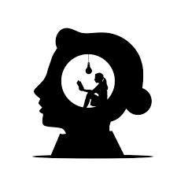

# Do nothing {#nothing}  

{width=3in}   

### Context {-}  
Doing nothing is an active process. It is not easy to 'do' at all. The book ['How to do nothing: resisting the attention economy'](https://www.penguinrandomhouse.com/books/600671/how-to-do-nothing-by-jenny-odell/) is a tranformative and novel text. Accepting and generating liminal spaces is one premise for the book. Another is that nature and place can support restoration and reframing of perception. Attention and perception are linked in this work, and it is proposed that deep listening or looking at things differently will enable a much more nuanced interaction with screens. We then think differently too. The premise of this book is not optimization. Nonetheless, using nature, art, and liminal experiences to be mindful of attention directly support better screen time decisions. A [gate-and-key model for attention and perception](https://www.frontiersin.org/articles/10.3389/fpsyg.2015.00500/full) is developed throughout the text. We have an incredible perception network biologically in how we, see, hear, and feel. Attention drives what we perceive. This should be an active decision - always. Screens are one of the phenomenal metophorical nets that catch our attention in so many ways. Use attention to decide what to focus on. Resist in place. Continue to use screens and digital tools of course but do so much more wisely through attention management and liminal, preferably, natural/local/outdoor restoration time.  

### Learning outcomes {-}  
1. Understand the key trait-mediated interactions that you curate digitally and physically in your life.  
2. Become aware of your daily digital routines.  
3. Appreciate how attention drives perception with respect to screen time and beyond.  

### Challenge time {-}  
1. Practice liminal and logical breaks. Walk to work. Try walking meetings or calls.
2. Try seeing things differently or hearing them via redirecting attention to novel components of a signal or information that an experience provides. This can include screens too - tool bars, ads, or any elements of digital work. Where do you focus and how do you listen? Apply this attention-focus awareness for meetings - real or virtual.     
3. Read this [review of how to do nothing](https://www.nytimes.com/2019/04/30/books/review/jenny-odell-how-to-do-nothing.html).  
4. Explore some the literature associated with [nature deficit disorder](https://en.wikipedia.org/wiki/Nature_deficit_disorder).  
5. Review this [slide deck](https://figshare.com/articles/presentation/How_to_do_nothing/19736179) on how to do nothing - actively.  

### Reflection questions {-}  
1. You are never alone in nature. Did this proposition resonante in any of the times you secured for a break/walk or mini-adventure between screen work instances. Did any of your affective components shift internally?  
2. In your daily routine, was there 'space' for attention to other experiences? Did you notice any opportunities that were already present for practiced awareness of the gate-and-key model but were unexploited?  
3. Can you invoke some ecology (organismal-others-environment) thinking to improve your performance either through liminal moments or direct opportunities within the digital work that you do?