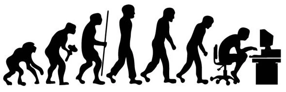

--- 
title: "Tools for human-screen interactions"
author: "cjlortie"
date: ""
site: bookdown::bookdown_site
documentclass: book
bibliography: [book.bib, packages.bib]
biblio-style: apalike
link-citations: yes
description: "An adaptationist programme for digital work and life"
---

# Screen adaptation theory 

{width=4in}  

### Context {-}  

Screens are a portal to information and to one another. [Nearly 5 billion people as of 2022 use the internet](https://datareportal.com/global-digital-overview). Treating screens and digital time only as a pathology neglects the inherent capacity for screens as a tool to promote higher levels of performance and novel approaches to problem solving. [Mental models and the associated cognitive architecture](https://www.frontiersin.org/articles/10.3389/fpsyg.2017.01335/full) that we frame conceptually to decision making is critical for better choices. The screen adaptation theory (SAT) is proposed herein as a heuristic to enable individuals to use evidence and structured thinking in approaching screen time decisions.  

Screens are a place. Going to work, visiting friends, visiting the library, and many other key personal tasks and professional functions are done via screens. It can seem trivial, but labeling these choices, explicitly, provides a sense of coherence and purpose. Screens as a place also provides context and ecology. Adaptation is the sum of traits that an individual possesses or develops that promote survival or higher levels of relative performance without those traits. The goal must be to amplify and identify traits that mitigate the real costs of screens and tip the net sum to positive and higher levels of performance. Theory is a set of principles. Many discipline support screens as a place and an adaptationist programme for screen time use. Source theory and scientific evidence depending the on specific context and choice.    


### Learning outcomes {-}   
1. Develop a new mental model for screen time.  
2. Explore and track decisions associated with screen time.  
3. Examine individual costs and benefits of screens.    


### Schedule {-} 
Here is an outline of the challenges proposed to explore these principles in this course.    

```{r, warning=FALSE, message=FALSE, echo=FALSE}
library(tidyverse)
schedule <- read_csv("./schedule.csv")
knitr::kable(schedule, booktabs = TRUE)

```

### Citation {-}  
lortie, cj (2022): Tools for human-screen interactions. figshare. Online resource. https://doi.org/10.6084/m9.figshare.19736182.v2 

### License {-}  

<a rel="license" href="http://creativecommons.org/licenses/by-nc-sa/4.0/"></a><br />This work is licensed under a <a rel="license" href="http://creativecommons.org/licenses/by-nc-sa/4.0/">Creative Commons Attribution-NonCommercial-ShareAlike 4.0 International License</a>.  

### Challenge time {-}  
Use [Google Scholar](https://scholar.google.com) and do a few search with screen time and .... for whatever personal challenge is most urgent. Screen time and memory or fatigue or focus or vision etc. Use the filter tool on the left to return hits from 2018 onwards.  

Review [slide deck for screen adaptation theory](https://figshare.com/articles/presentation/Screen_attention_theory/19686291).  

Read [screen adaptation theory at Ideas in Ecology and Evolution](https://ojs.library.queensu.ca/index.php/IEE/article/view/15653).  

Track screen time use even cursorily. There are digital tools and functions included in the operating system of many devices. Or, go old school and have fun with it using a kitchen timer, stopwatch, or clock.  

### Reflection questions {-}  
1. Did any of the work associated with screen time resonate with your challenge? If so, did the evidence nudge or shift your model and thinking? 
2. Do you use mental models for other dimensions of your life such as training, sleep, or performance?  Does your employer or team adopt models for performance?
3. Did tracking confirm your assumptions on frequency and duration of screen time?  


```{r include=FALSE}
# automatically create a bib database for R packages
knitr::write_bib(c(
  .packages(), 'bookdown', 'knitr', 'rmarkdown'
), 'packages.bib')
```
